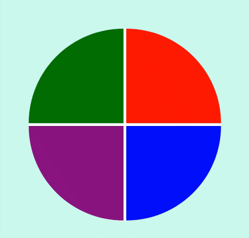

# Bootcamp - Javascript Game Developer

  

## 🚀 Descrição
Jogo estilo 'Genius' desenvolvido com Javascript puro.
Projeto focado na fixação de conceitos da linguagem, váriaveis, funções, arrays, manipulação do DOM, etc...
 
Veja o projeto de forma interativa: [Genius](https://genius-game-kev.netlify.app/)

## 🔧 Alterações realizadas no projeto
 - Menu inicial
 - Correção do Bug onde a cor permanecia selecionada.
 - Responsividade para mobile.
 - Mudança no click ao selecionar as cores.
 - Mensagens toast-notification personalizadas ao acerta 'X' sequência de acertos.

## 🖥️ preview final do projeto

  

