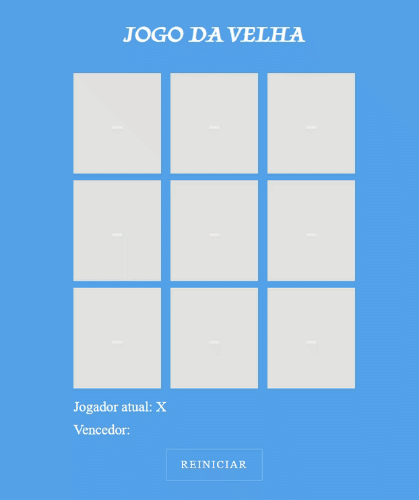

# Bootcamp - Javascript Game Developer

  
  

## 🚀 Descrição
Jogo da velha desenvolvido com Javascript puro.
 
Projeto Online: [Jogo da Velha](https://jogodavelha-kev.netlify.app/)

## 🔧 Alterações realizadas no projeto
 - Design
 - Responsividade

## 🖥️ preview final do projeto

  

