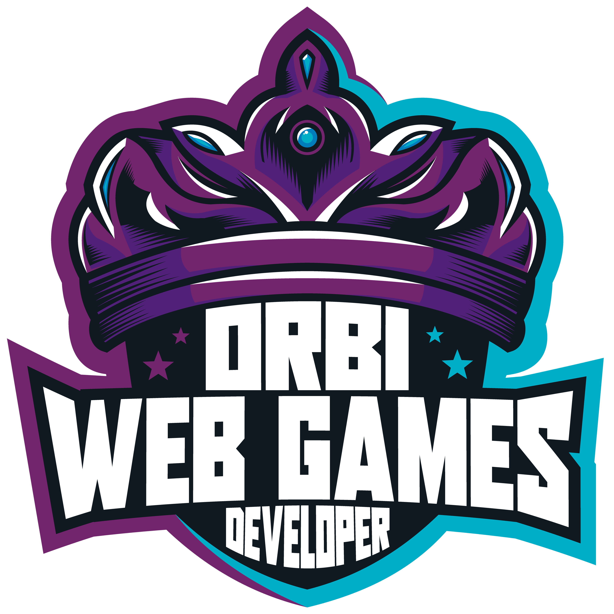

# Bootcamp - Javascript Game Developer

  
  

## 🚀 Descrição
Repositório criado com o objetivo de compartilhar todos os meus projetos e desafios desenvolvidos ao longo do bootcamp Javascript Game Developer e do bootcamp Órbi Web Games Developer.
  

## 📚 Principais aprendizados até agora:
  
 
Pensamento computacional

    <ul> <ul>
      <li> Decomposição / Reconhecimento de padrões </li>
      <li> Abstração e Algoritmos </li>
    </ul> </ul>
  

  
 
Lógica de programação Essencial 

    <ul> <ul>
      <li> Algoritmo e pseudocódigo </li>
      <li> Fluxograma, variáveis e constantes </li>
      <li> Estrutura de repetição </li>
      <li> Desvios condicionais e boas práticas </li>
      <li> Matrizes e vetores </li>
    </ul> </ul>
  

  
 
 Introdução Git e Github 

    <ul> <ul>
      <li> Entendendo Git / Comandos básicos </li>
      <li> Como o Git funciona / objetos internos do Git </li>
      <li> Chave SSH e Token </li>
      <li> Ciclo de vida </li>
      <li> Conflitos no Git e como resolve-los </li>
    </ul> </ul>
  

  
 
 Projetos ágeis com Scrum 

    <ul> <ul>
      <li> Introdução a gestão de projetos com Scrum </li>
      <li> Papel e responsabilidade de cada integrante do time </li>
      <li> Cerimônias do Scrum </li>
      <li> Gestão de projetos tradicionais vs Agil </li>
      <li> Conceitos e planejamentos de tarefas / Rotina Agil </li>
    </ul> </ul>
  

 
 
 Criação de websites com HTML5 e CSS3 

    <ul> <ul>
      <li> Estrutura de uma página Web </li>
      <li> Semântica </li>
      <li> HTML5 </li>
      <li> CSS3 </li>
    </ul> </ul>
  

 
 
 Construindo páginas para a internet com Bootstrap 

    <ul> <ul>
      <li> Visão geral do Framework </li>
      <li> Aplicando Bootstrap na prática </li>
    </ul> </ul>
  

  
 
Javascript ES6 Essencial

    <ul> <ul>
      <li> História e conceitos </li>
      <li> Curring, Hoisting, Imutabilidade, Tipos e Variáveis </li>
      <li> Funções e operadores </li>
      <li> Spreed, estruturas condicionais e repetição </li>
      <li> Introdução a orientação a objetos e Design Patterns </li>
      <li> Criando e manipulando arrays </li>
      <li> Map, filter e reducer </li>
      <li> Iterar, buscar e transformar elementos </li>
    </ul> </ul>
  

  
 
Fundamentos de arquitetura de sistemas

    <ul> <ul>
      <li> Web Service </li>
      <li> Estrutura SOAP </li>
      <li> Entendendo WSDL e XSD </li>
      <li> REST, API e JSON </li>
      <li> Integração REST e métodos HTTP </li>
      <li> Modelos Monolito e Microserviço </li>
      <li> Arquitetura da internet das coisas, protocolo de comunicação e Cloud </li>
    </ul> </ul>
  

 

## 🔧 Principais projetos desenvolvidos:
  - [Instagram Page Login Clone](https://github.com/kevenalves/Dio-Javascript-Game-Developer/tree/main/LandingPage-Instagram)
  - [Snake Game](https://github.com/kevenalves/Dio-Javascript-Game-Developer/tree/main/Snake-Game)
  - [Genius Game](https://github.com/kevenalves/Dio-Javascript-Game-Developer/tree/main/Genius-Game)

 

## 🚧 Repositório em contrução! 🚧
     

<strong>Bootcamp oferecido por: </strong> <a href="https://dio.me/">Digital Innovation One</a> 
