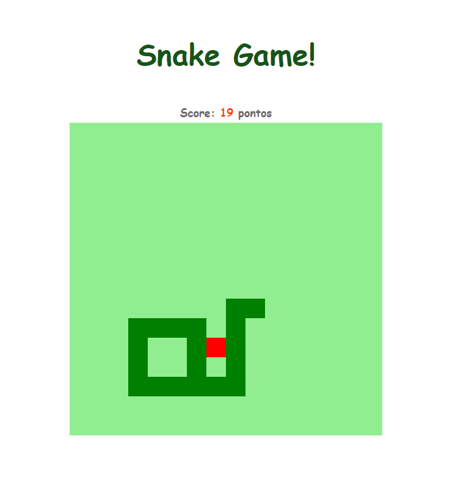

# Bootcamp - Javascript Game Developer

  

## 🚀 Descrição
Jogo da cobrinha iniciante desenvolvido com Javascript puro.
Projeto focado na fixação de conceitos da linguagem, váriaveis, funções, arrays, manipulação do DOM...
 
Veja o projeto de forma interativa: [Snake Game](https://snake-game-kev.netlify.app/)

## 🔧 Alterações realizadas no projeto
 - Adição do score no jogo
 - Alterações no design
 - Adição do pop-up de game over e função de restart

## 🖥️ preview final do projeto

  

